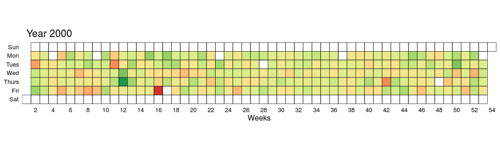

# heatmap-dow-jones

[ggplot2](https://github.com/hadley/ggplot2) implementation of Mike Bostocks [D3 Heatmaps of Dow Jones Industrial Index](https://mbostock.github.io/d3/talk/20111018/calendar.html)

### Year 2008

### All years from 1995 to 2008

[View Larger Plot](https://raw.githubusercontent.com/narenchoudhary/heatmap-dow-jones/master/dowjones_change_heatmap2.png)

